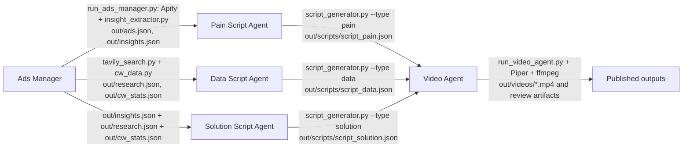

# CrowdWisdomTrading Agent

Creates a Kanban-managed production pipeline for short-form trading videos:
Meta ad research and data analysis feed three script variants, which feed the
video renderer.

## Architecture



`pipeline.py` creates the linked Hermes Kanban tasks. Hermes workers run the
tools assigned to each task.

## Prerequisites

- Python 3.10+
- Hermes CLI on `PATH` (use the Hermes distribution provided by your team)
- `ffmpeg` and `ffprobe` on `PATH` (or `FFMPEG_PATH` and `FFPROBE_PATH`)
- Piper TTS: installed by `requirements.txt` as `piper-tts`
- Piper voice model at `models/en_US-lessac-medium.onnx` and its `.json` config

## Setup

```bash
cp .env.example .env
```

Windows PowerShell:

```powershell
Copy-Item .env.example .env
```

The runners create `.venv` and install [requirements.txt](./requirements.txt).

### Environment keys

| Key | Purpose | Where to get it |
|---|---|---|
| `APIFY_TOKEN` | Runs the Meta Ads scraper | Apify Console → Settings → Integrations → API tokens |
| `OPENROUTER_API_KEY` | Generates insights, stats selections, and scripts | OpenRouter Keys page |
| `OPENROUTER_MODEL` | OpenRouter model ID to use | OpenRouter Models page; use the provider/model slug |
| `TAVILY_API_KEY` | Web research for pain points | Tavily dashboard → API keys |
| `EXA_API_KEY` | Fallback web research provider | Exa dashboard → API keys |

Never commit `.env`.

## One-command run

Windows:

```powershell
.\run.ps1
```

Bash, Linux, macOS, or Git Bash:

```bash
./run.sh
```

The runner creates the virtual environment, installs dependencies, validates
all required keys, checks Hermes, and starts `pipeline.py`.

## Outputs

```text
out/
├── ads.json                 # normalized Meta ads
├── insights.json            # ad pains, angles, hooks, and ICPs
├── research.json            # Tavily/Exa research
├── cw_stats.json            # selected statistics from data/
├── scripts/
│   ├── script_pain.json
│   ├── script_data.json
│   └── script_solution.json
├── videos/
│   ├── video_pain.mp4
│   ├── video_data.mp4
│   └── video_solution.mp4
└── .cache/                  # content/model-keyed intermediate results
```

The video agent also writes per-project audio, first-three-second previews, and
sample frames under `out/videos/`.

## Kanban flow

`pipeline.py` initializes Hermes, then creates these idempotent tasks:

1. `T1` Ads Manager
2. `T2a` Pain script, dependent on `T1`
3. `T2b` Data script, dependent on `T1`
4. `T2c` Solution script, dependent on `T1`
5. `T3` Video Agent, dependent on all three script tasks

Existing tasks are reused by idempotency key, so rerunning the command does not
duplicate the graph.

## Caching

Tools cache successful intermediate results under `out/.cache/` using input
content hashes and, where relevant, the selected model. Normal runs reuse
matching cache entries. Use `--refresh` on individual tools to bypass cache:

```bash
python tools/run_ads_manager.py --refresh
python tools/tavily_search.py --refresh
python tools/cw_data.py --refresh
python tools/script_generator.py --type all --refresh
```

## Troubleshooting

- **Missing `.env` or keys**: copy `.env.example` to `.env`; the runner lists
  missing keys without printing secret values.
- **`hermes` not found**: install the Hermes CLI used by your deployment and
  add it to `PATH`.
- **`ffmpeg`/`ffprobe` not found**: install FFmpeg, add its `bin` directory to
  `PATH`, or set `FFMPEG_PATH` and `FFPROBE_PATH`.
- **Piper model not found**: place both
  `models/en_US-lessac-medium.onnx` and
  `models/en_US-lessac-medium.onnx.json` in `models/`.
- **API failures**: verify the key, provider quota, and `OPENROUTER_MODEL`;
  retry without `--refresh` first to use valid cached results.
- **Clean-room check**:

  ```powershell
  powershell -ExecutionPolicy Bypass -File scripts/clean_room_test.ps1
  ```
